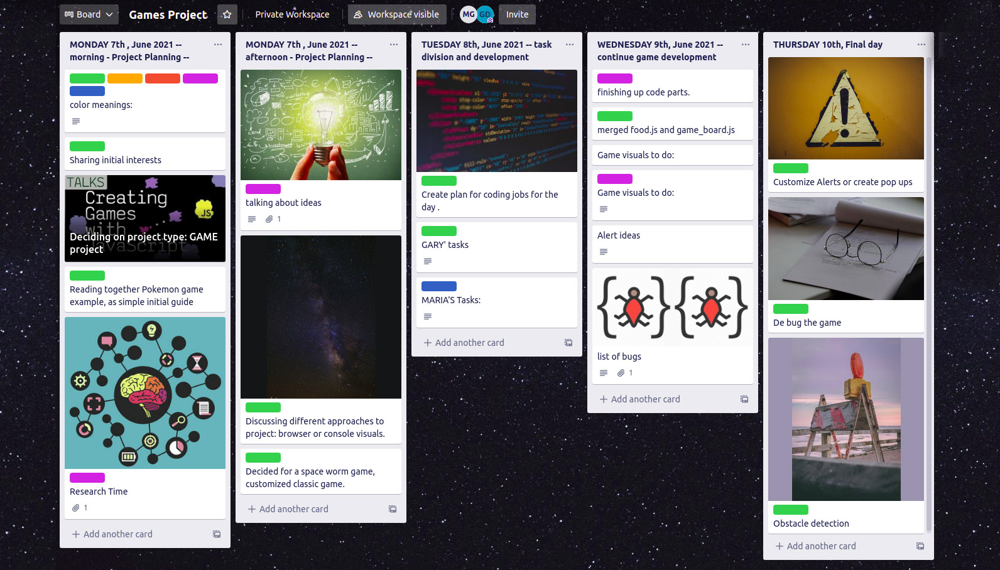
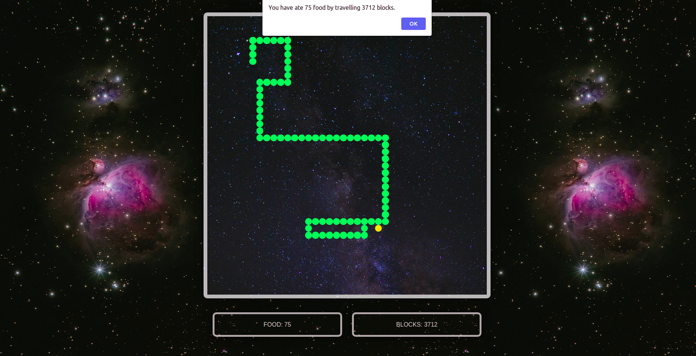
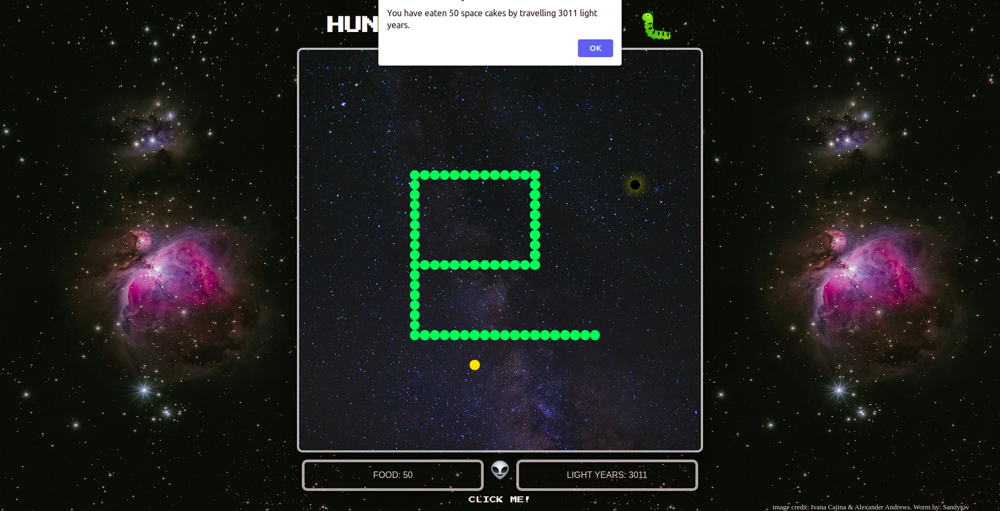
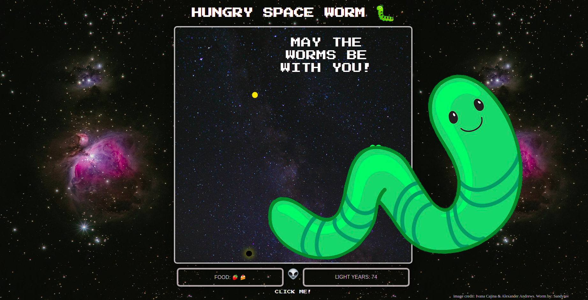
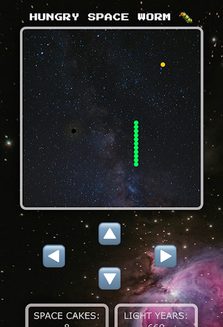

For work done so far:

---> see daily screenshots for update

7th JUNE
--------

1. Description of color labels:

GREEN : done!

PINK: On going

RED: To be done

ORANGE: Gary

BLUE: Maria

-------------------------
 
 2. Sharing initial interests

 -------------------------
 3. BRAINSTORMING:
  
  i. Role play type of game.
  
  ii. visual, use of emojis and ASCII for food, locations,...
  
  iii. character goes from A to Z, how, stops, recharge, instructions, storyline....

 ---------------------------------

 4. Discussing different approaches to project: browser or console visuals.

 ----------------------------------

 5. Decided for a space worm game, customized version of the classic snake game.

 ------------------------------------------------------

 6. Started:

  I. created a github repository.

  II. created a html index file with basic html and CSS.

  III. added space background image.

  IV. created 3 js files: character, game, grid.

  -------------------------------------------------

8th JUNE
--------
Decided to work on separated files : 4 js files in total, 2 for each.
We use temporarily a basic html and css file as template and we will change afterwards.

food.js  ---> MARIA

space_worm.js (character direction, movement, )  ---> MARIA

game_board.js (game grid)   --->  GARY

game.js  (score (2 lines) + code to start game) ----> GARY

------------------------

work done on the files so far:

_***************************_

MARIA:

    food.js: 
    ---------

    A function that adds or removes and repositions (adds again) food in the game board randomly. Original food position is set to 0.

    space_worms.js : 
    --------------

    1. declared the directions of the space worm in the board, by assigning keyboard arrow keys.

    2. set initial space worm location

    3. function to change the direction of space worm with "if" and "if else" statements

    4. set the starting position of the space worm to the center

    5. function to move the worm with switch cases

    6. if statement to end game if space worm eats its own body and printing alert of food eaten and space travelled

    7. space worm Length is used as the timeout interval

    8. updated the distance travelled
    
    9. link to html visual when/if space worm eats food (head of worm hits food item) then food is added and new food position is created.

    -----------------------------------------------------------------------------------

9th JUNE
--------

* finishing up individual code parts.

* merged food.js and game_board.js. Current files game_board.js, game.js, space_worm.js

*  1* title banner. done, to be reviewed

   2* change color scheme --> done, to be reviewed

   3* move score boards 
   
   4* change alert messages. --> some done, more to be added
   
   5* slow down perhaps. --> done 
   
   6* expand screen ? ---> not working
   
   7* update trello screenshot and markdown in github
   
   8* change food or/and worm visuals (perhaps emojis, different food types?)
   
   9* maybe obstacles -collision MAYBE

   10* added favicon green worm  --> done

   ------------------

   ALERT Ideas:

   i. You can always eat more !

   ii. Hey there more Cake in the universe you lose
   
   iii. Well super Worm done you win
   
   iii. No worm left behind you lose
   
   iv. You need more Cake
   
   v.  you have eaten X space cakes by travelling X light years

   vi. BLACK HOLE!! You have travelled to another dimension. You have eaten X space cakes by travelling X light years.

   ------------------------------

   bugs we found:

   1. conflicts in git, pulling and pushing

   2. conflicts due to dividing game tasks, that required rather a common work, so naming conflict, etc...

   3. problems to make the arrow keys of keyboard work

   4. problems to make worm appear in screen.

   -------------------------------

10th JUNE
--------
   
done:

1. BLACK HOLE obstacle: collision detection, creating obstacles and consequence. Created a new class "blackhole" and add it randomly: so every time a piece of food is eaten the backhole is also repositioned randomly in the gameboard. There is always 1 blackhole like there is always 1 food, and in theory they could be in the same place! If the space worm hits the black hole, game over. SO it clears the  original setINterval with clearInterval(moveWormInterval) and prints and alert with space food eaten and light years travelled.

2. We have 2 types of alert, a.) when worm is killed by eating its own tail or hitting the gameboard limits (top of gameboard) and b). by entering a black hole.

3. wormLength:  Original length of space worm, set to 300  (equivalent to 3 worm rings) and grows as it eats.

4. Speed: setInterval has set an initial speed = 100. THere are if statements to add conditions, so if space worm eats 50 food, speed increases (in our case speed goes -20), after eating other 50 => 100, speed accelerates -20 more (so speed -40), etc...

5. Greetings button: added an alien emoji that is invited to be clicked, on click it shows a green worm coming out of game board with message: "may the worms be with you"

6. Game testing on going: testing game on people and providing screen shots of scores.

7. Images are free use but authors credit added.

8. Screenshot of our trello working board.

9. Fixed bugs for mobile version and github pages

10. Added sound effect to onclick event, the worm pop-over, so when you click it shows the worm, the message and plays a little sound.

   
 

